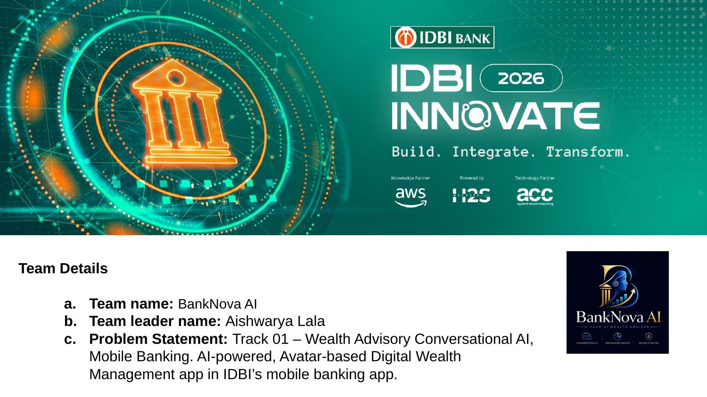
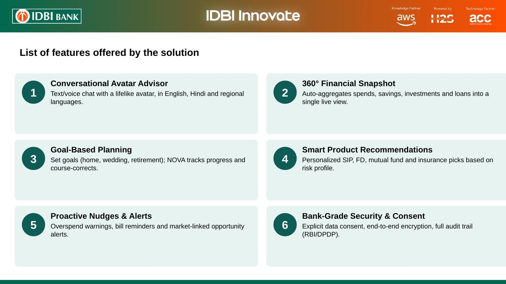
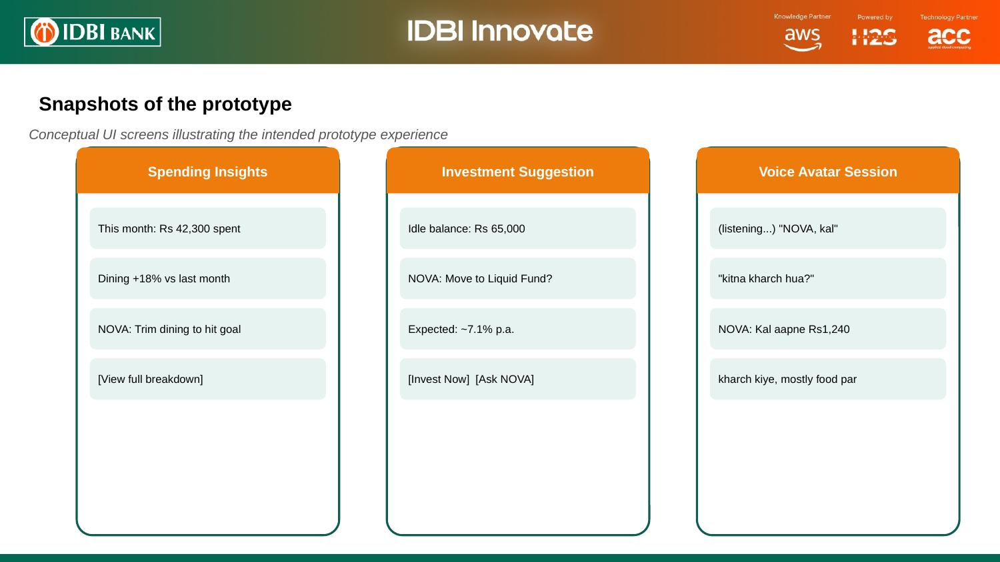
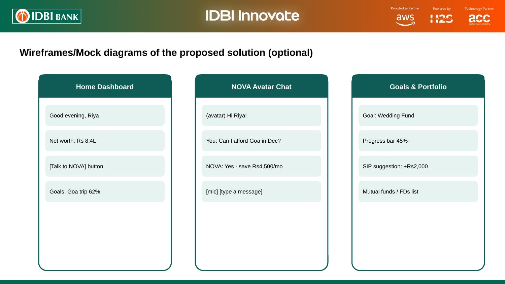
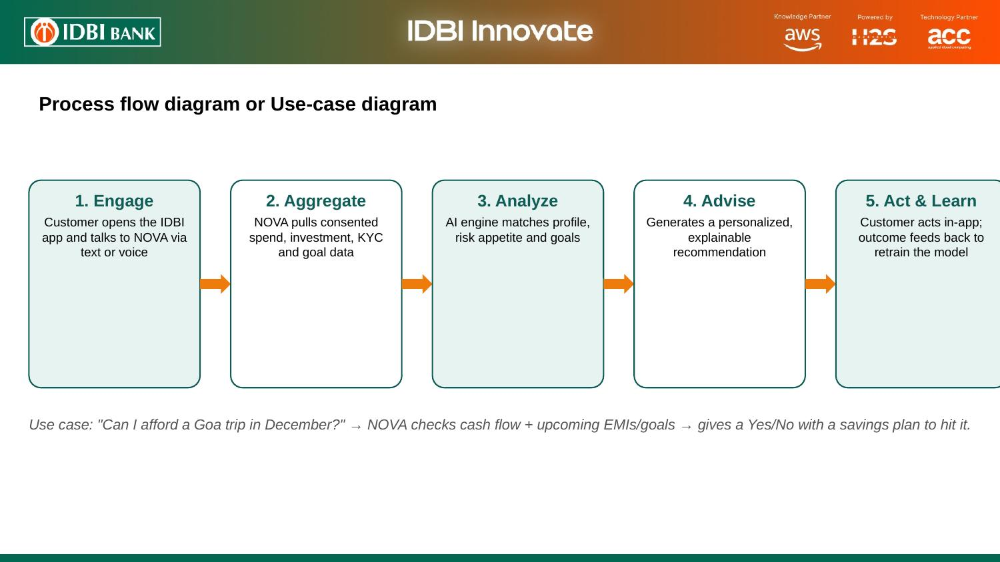
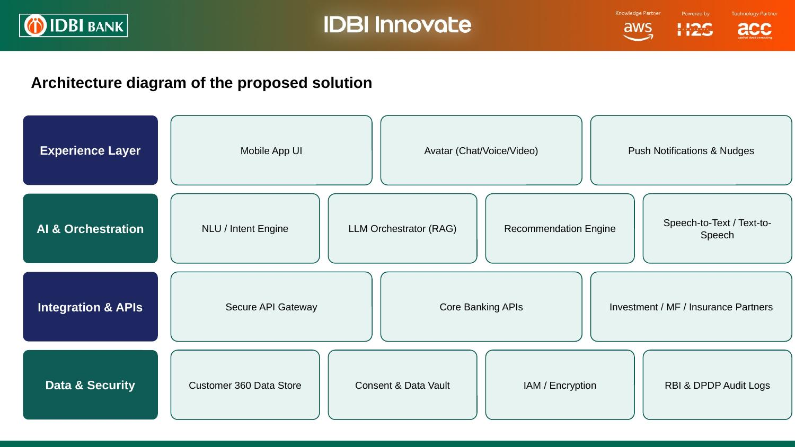
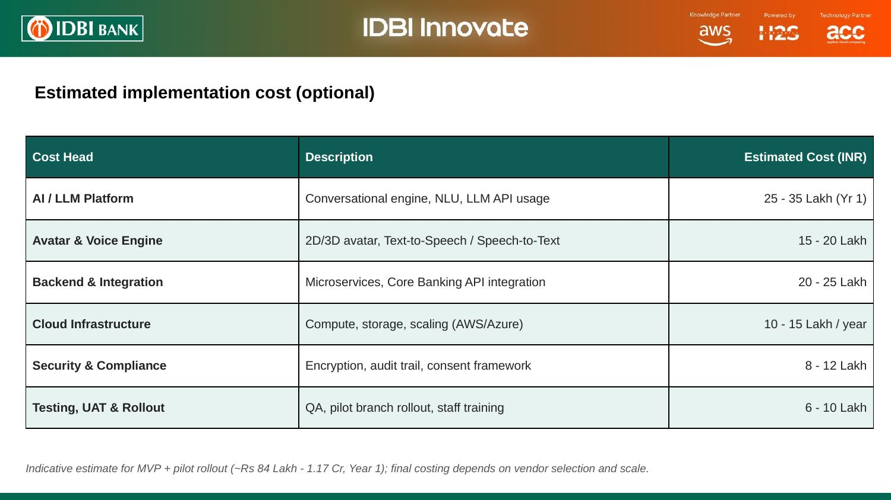

# NOVA — AI Avatar Wealth Advisor for IDBI Mobile Banking

NOVA is an avatar-based conversational AI wealth advisor built for **IDBI Innovate 2026 — Track 01 (Wealth Advisory Conversational AI, Mobile Banking)**. It lives inside the IDBI mobile app and turns a customer's spending, savings, and investment data into simple, personalized, day-to-day financial guidance — through chat, voice, and proactive nudges.

**🔗 Live App: [https://aishu1312.github.io/banknova-ai-digital-wealth-management/](https://aishu1312.github.io/banknova-ai-digital-wealth-management/)**

Built by **Team BankNova AI**  
Team Lead: **Aishwarya Lala**

Team Members:
- Jay Sompura
- Harshita Gulbake
- Adinath Kurhadkar

---

## 1. Problem Statement

**Track 01 — Digital Wealth Management**

## 2. Solution Overview

NOVA is a lifelike avatar advisor that lives inside the IDBI mobile app. It continuously reads a customer's transaction history, spending patterns, savings behaviour, and existing investments (with explicit consent), and turns that into conversational, actionable guidance — instead of static dashboards nobody opens.



## 3. Submission Links

- GitHub repo: https://github.com/Aishu1312/banknova-ai-digital-wealth-management
- Live app: https://aishu1312.github.io/banknova-ai-digital-wealth-management/
- Demo video: _add link here_
- Final product / deployed link: https://aishu1312.github.io/banknova-ai-digital-wealth-management/

## 4. Core Features

- 🤖 **AI avatar financial advisor** — chat-based guidance grounded in the customer's real financial snapshot
- 📊 **Spending analysis** — category breakdown and weekly trend charts
- 📈 **Investment recommendations based on risk profile** — a short quiz drives a Conservative / Moderate / Aggressive allocation
- 🎯 **Goal-based planning** — home, education, retirement and custom goals with progress tracking
- 💰 **SIP / FD / mutual fund suggestions** — tailored to the customer's risk profile
- 🎙️ **Voice interaction** — mic input and spoken replies via the Web Speech API
- 🔔 **Personalized notifications** — overspend alerts, idle-balance tips, goal milestones, bill reminders
- 💼 **Portfolio dashboard** — net worth, asset allocation, holdings



## 5. App Screens

A working front-end prototype simulates the experience end-to-end: home dashboard, NOVA chat, goals, investments, and alerts — all inside a mobile app frame.




## 6. How NOVA Responds — Process Flow

Engage → Aggregate → Analyze → Advise → Act & Learn. Every recommendation is generated from the customer's actual data and feeds back into the model as they act on it.



## 7. System Architecture

Four layers: an experience layer (avatar, chat, voice), an AI & orchestration layer (NLU, LLM orchestrator, recommendation engine), an integration layer (secure API gateway to core banking and investment partners), and a data & security layer (consent vault, encryption, RBI/DPDP-aligned audit logs).



## 8. Tech Stack

- **Frontend:** React 18 + Vite, Tailwind CSS
- **Charts:** Recharts
- **Icons:** lucide-react
- **Conversational AI:** Claude (Anthropic API) via a lightweight backend proxy
- **Voice:** Web Speech API (SpeechRecognition + SpeechSynthesis)
- **Backend proxy:** Node.js + Express (keeps the API key server-side)

## 9. Security & Consent

- The Anthropic API key is **never exposed in the browser** — all chat calls go through the `/server` proxy.
- The prototype is designed around explicit customer consent for data aggregation, in line with RBI and DPDP Act expectations.
- No real transactions are executed by NOVA — it only advises and explains.

## 10. Estimated Implementation Cost (Indicative)



## 11. Deployment Instructions

The live demo at the top of this README is auto-built and published to GitHub Pages by a GitHub Actions workflow (`.github/workflows/deploy.yml`) on every push to `main`.

To run it locally instead:

1. **Clone the repository:**

```bash
git clone https://github.com/Aishu1312/banknova-ai-digital-wealth-management.git
cd banknova-ai-digital-wealth-management
```

2. **Install dependencies and run the app:**

```bash
npm install
npm run dev
```

The app opens as a mobile app frame in your browser. The NOVA chat tab works out of the box with built-in demo responses, even without the backend proxy running.

3. **(Optional) Enable live AI responses:**

```bash
cd server
npm install
cp .env.example .env   # add your own ANTHROPIC_API_KEY
npm start
```

Then, in a separate terminal from the project root, run `npm run dev` again — the frontend automatically calls the local proxy at `/api/chat`.

4. **Build for production:**

```bash
npm run build
npm run preview
```

Deploy the `dist/` folder to any static host (Vercel, Netlify, GitHub Pages). Deploy `/server` separately if you want live chat in production.

## 12. Future Scope

- SEBI-registered robo-advisory: move from guidance to direct, auditable execution
- Deeper regional language and voice-first support for Tier 2/3 cities
- Gamified financial literacy micro-lessons for first-time investors
- Omni-channel presence — WhatsApp Banking and IVR
- Consent-based family/household view for joint goal planning

---

*Built for IDBI Innovate 2026, Track 01, by Team BankNova AI.*
